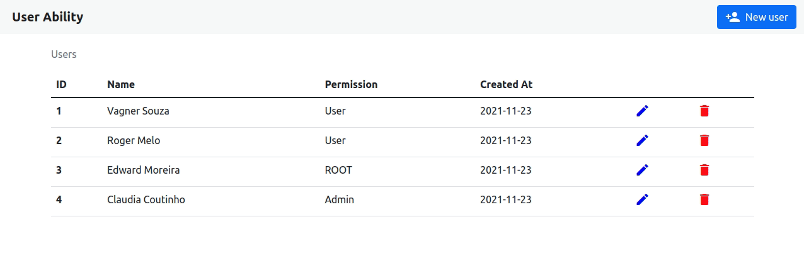

  <h1 align="center"> 👥 User Ability 👥</h1>

<strong>
  

    <a href="#-about">About</a> |
    <a href="#-software">Software</a> |
    <a href="#-dependencies">Dependecies</a> |
    <a href="#-functionalities">Functionalities</a> |
    <a href="#-technologies">Technologies</a> |
    <a href="#-how-to-download-and-execute">How to execute</a> | 
    <a href="#-demo">Important links</a> | 
    <a href="#-author">Author</a> | 
    <a href="#-show-your-support">Suport</a>
  

</strong>

## 🧐 About
The main idea it was, put all my actual knowledge developing a microservice focused on user control.

It includes:
- CRUD;
- API (REST / RESTfull);
- Swagger

## 👨‍💻 Software

  

---

### Demo 👀
 #### 🕹  The app 
- [**Link**](https://userability.herokuapp.com/users)
 #### 📄 Swagger documentation
- [**Link**](https://userability.herokuapp.com/swagger-ui.html)

---

## ❗ Dependencies
To run this project, you will need of following tools installed on your machine:
- [Java & Kit](https://www.oracle.com/java/technologies/javase/jdk16-archive-downloads.html)
- [IntelliJ IDEA](https://www.jetbrains.com/idea/)
- [Maven](https://maven.apache.org/)
- [Postman](https://www.postman.com/)

---

## 🖥 Functionalities

#### C
- Create new User
  - POST
#### R
- Read a User
  - GET
#### U
- Update specific User
  - PUT
#### D
- Delete specific User
  - DELETE

> WEB & Postman
---
## 👷 How to [download](https://github.com/edward-mn/userability/archive/master.zip) and <b>Execute<b>

### How to compile the project 💻
1. Download the project on your machine.
2. Extract the downloaded zip.
3. Create a new project from an existing project (Import project).
4. After the project loaded in your IDE click with the right button on the project name -> Maven -> Reinport to confirm the necessary imports.
5. Click on the top right of your ide (ADD CONFIGURATIONS) -> (+) -> Maven.
6. In the "Command Line" field add (spring-boot:run) -> Apply -> OK.
7. Ready now, just run the program and the server is running on port 8080.

### How to execute🏃
1. Via Postaman
    1. Open the postman.
    2. In the upper left corner click (Import) -> Choose Files -> Go to where you extracted the project and the select the userability.postman_collection.json file.
    3. Select the endpoint you want within the imported [userability.postman_collection.json](userability.postman_collection.json) collection and click send.
        1. Pay attention and make changes when you are consuming de User API
2. WEB
    1. After run the application (<i> ./mvnw spring-boot:run</i> )
    2. Open your browser into port 8080 (<i> http://localhost:8080/ </i>)
    3. Or use the heroku deployment bellow
        1. APP -> https://userability.herokuapp.com/users
        2. Swagger -> https://userability.herokuapp.com/swagger-ui.html

---

## 🛠 Technologies
- [IntelliJ IDEA](https://www.jetbrains.com/idea/)
- [Java 16 & Kit](https://www.oracle.com/java/technologies/javase/jdk16-archive-downloads.html)
- [Spring boot](https://spring.io/projects/spring-boot)
- [Postgre SQL](https://www.postgresql.org/)
- [Bootstrap 5.1](https://getbootstrap.com/docs/5.1/getting-started/introduction/)
- [Google Icons](https://fonts.google.com/icons?selected=Material+Icons&icon.query=new)
- [Postman](https://www.postman.com/)
- [Heroku](https://www.heroku.com)
- [Dependencies - Maven](https://mvnrepository.com/artifact/org.springframework.boot/spring-boot-starter)
  - [Thymeleaf](https://www.baeldung.com/spring-boot-crud-thymeleaf)
  - [DevTools](https://www.baeldung.com/spring-boot-devtools)
  - [Data JPA](https://spring.io/projects/spring-data-jpa)
  - [Spring Web](https://docs.spring.io/spring-boot/docs/current/reference/htmlsingle/)
  - [PostgreSQL Driver](https://docs.spring.io/spring-cloud-dataflow/docs/1.1.2.RELEASE/reference/html/configuration-rdbms.html)
  - [Swagger 2.0](https://www.baeldung.com/swagger-2-documentation-for-spring-rest-api)
  - [Starter Validation](https://www.baeldung.com/spring-boot-bean-validation)

---

## 🦹‍ Author

* **Edward Moreira**
* :octocat: [@edward-mn](https://github.com/edward-mn)
*  
* :rocket: [Edward Moreira](https://app.rocketseat.com.br/me/edward-moreira-do-nascimento-02578)

---

## 🤝 Show your support

Give a ⭐️ if liked or helped you!

***

<strong>
  
 This README was created with ❤️ by me 

</strong>
